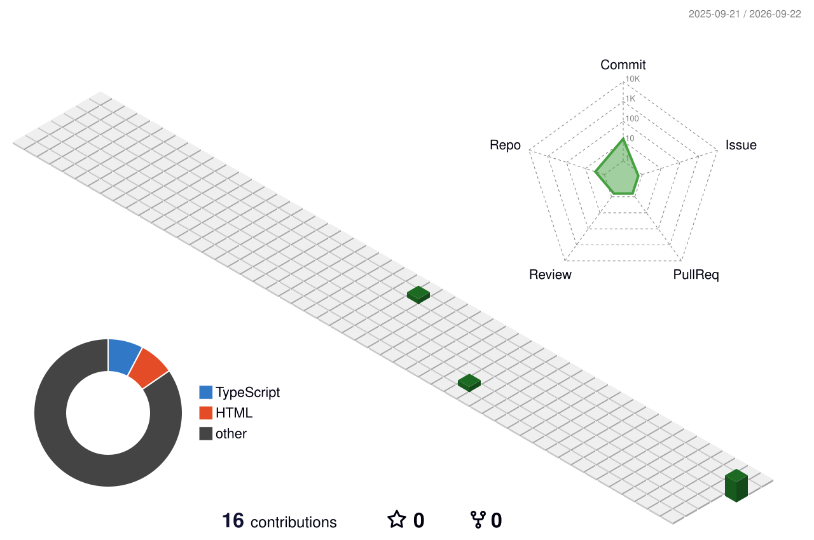
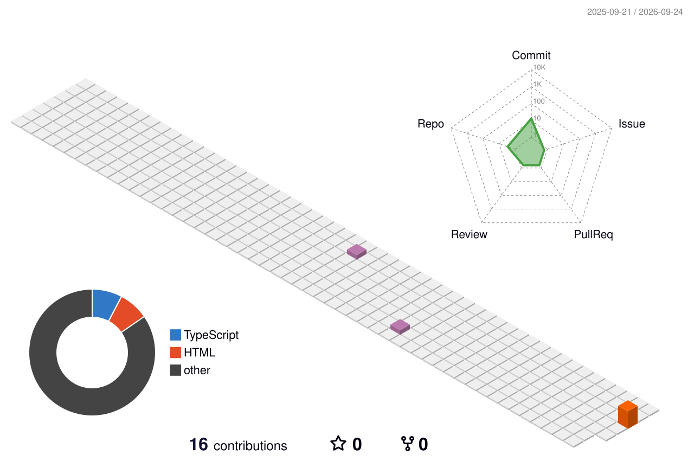
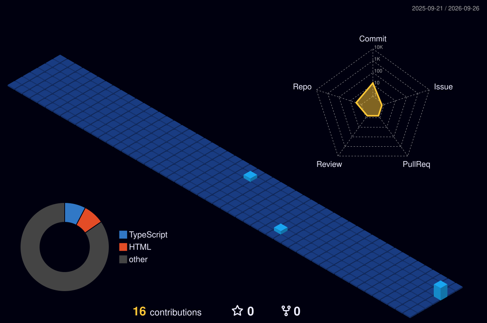
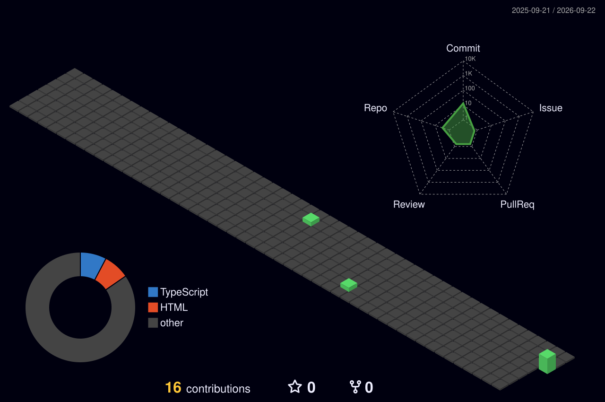
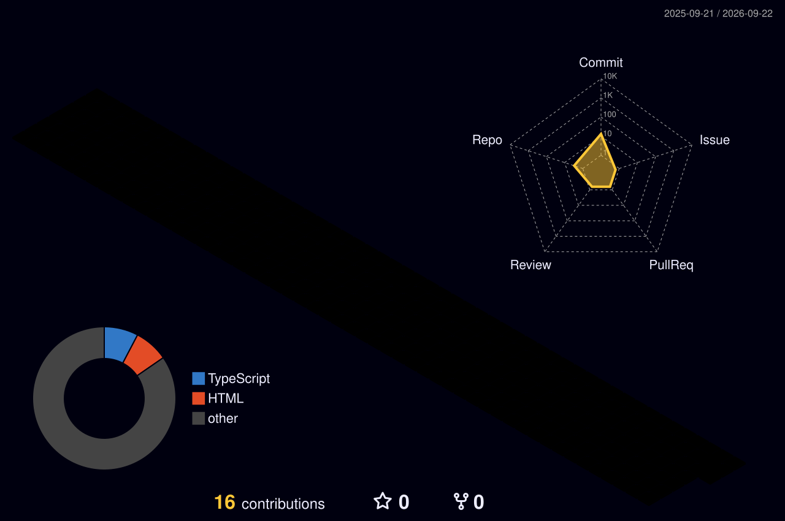
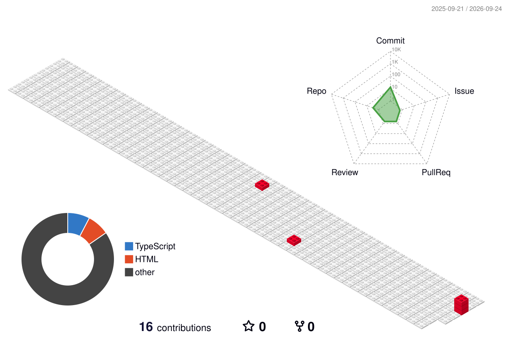

 <!-- ═══════════════════════════════════════════════════════════════ --> <!-- HERO SECTION --> <!-- ═══════════════════════════════════════════════════════════════ --> 
👋 Hey, I'm Yash
Developer · Builder · Problem Solver · Tech Explorer

  
    &nbsp;  &nbsp;  

🧑‍💻 About Me
╭──────────────────────────────────────────────────────────────────╮
│                                                                  │
│   👋 Hi, I'm Yash.                                               │
│                                                                  │
│   💻 I build software.                                           │
│   🧠 I enjoy understanding how things work.                     │
│   🔬 I experiment with technologies and ideas.                   │
│   🚀 I turn concepts into real projects.                         │
│   📚 I learn by building.                                        │
│   🛠️ I debug until I understand the problem.                    │
│                                                                  │
│   My philosophy:                                                  │
│                                                                  │
│       THINK → BUILD → BREAK → LEARN → IMPROVE → SHIP            │
│                                                                  │
╰──────────────────────────────────────────────────────────────────╯

I'm interested in software development, problem solving, developer tooling, modern web technologies, and anything that gives me an excuse to open a terminal and start building.

I don't believe in knowing everything.

I believe in being able to figure things out.

⚡ What I'm About
<table> <tr> <td width="50%">
🧠 Learn

I like going beyond the surface and understanding why something works, not just how to use it.

</td> <td width="50%">
🛠️ Build

The fastest way I learn something is by actually building with it.

</td> </tr> <tr> <td width="50%">
🔬 Experiment

New technology? Interesting architecture? Weird idea?

Let's build it.

</td> <td width="50%">
🚀 Ship

A project sitting in a folder isn't finished.

Build it. Test it. Improve it. Ship it.

</td> </tr> </table>
🧰 Technology Universe

💻 Languages

  

⚛️ Frameworks & Runtime

  

🗄️ Databases

  

☁️ Cloud / DevOps

  

🔧 Tools
 

🧪 Experimental stack: This section is intentionally broad during the testing phase. We'll replace it with your exact technologies later.

📊 GitHub Metrics

  

🧊 3D Contribution Universe

🌱 Green

  

🌈 Seasonal

  

🌙 Night View

  

🌌 Night Green

  

🌈 Night Rainbow
 

📈 GitHub Statistics

   

🔥 GitHub Streak

  

📅 Contribution Calendar

  

🏆 GitHub Achievements

  

📊 Activity Overview

  

🧩 My GitHub Ecosystem
<table> <tr> <th align="center">📅 Contributions</th> <th align="center">💻 Code</th> <th align="center">⭐ Stars</th> </tr> <tr> <td align="center">  </td> <td align="center">

Repositories 
Commits 
Pull Requests 
Issues 
Code reviews

</td> <td align="center">

Projects 
Repositories 
Open Source 
Community

</td> </tr> </table>
🚀 Featured Projects

 <table> <tr> <td width="50%" valign="top">
🔥 Project One

Replace this with one of your strongest projects.

What it does

Explain the problem this project solves.

Stack

React Node.js MongoDB

Highlights

⚡ Fast

🧩 Modular

📱 Responsive

🔐 Secure

 </td> <td width="50%" valign="top">
⚡ Project Two

Replace this with another project.

What it does

Explain the project in a few lines.

Stack

Next.js TypeScript PostgreSQL

Highlights

🚀 Production ready

🧠 Interesting architecture

🛠️ Actively maintained

📈 Scalable

 </td> </tr> <tr> <td width="50%" valign="top">
🧪 Experimental Project

Something experimental, unusual, or built primarily to learn.

Python AI APIs

</td> <td width="50%" valign="top">
🛠️ Developer Tool

A utility, automation project, CLI, library, or tool.

Node.js CLI GitHub Actions

</td> </tr> </table> 

🧠 Currently Exploring
╭──────────────────────────────────────────────────────────╮
│                                                          │
│   🧠  Software Architecture                              │
│   ⚡  Modern Web Development                              │
│   🤖  AI & Developer Tools                                │
│   ☁️  Cloud & Infrastructure                              │
│   🔐  Security & Best Practices                           │
│   🐳  Containers & DevOps                                 │
│   📊  Data & Automation                                   │
│                                                          │
╰──────────────────────────────────────────────────────────╯

🧪 My Development Loop

             ┌──────────────┐
             │    IDEA 💡   │
             └──────┬───────┘
                    │
                    ▼
             ┌──────────────┐
             │   RESEARCH   │
             └──────┬───────┘
                    │
                    ▼
             ┌──────────────┐
             │    BUILD 🔨  │
             └──────┬───────┘
                    │
                    ▼
             ┌──────────────┐
             │   BREAK 💥   │
             └──────┬───────┘
                    │
                    ▼
             ┌──────────────┐
             │   DEBUG 🐛   │
             └──────┬───────┘
                    │
                    ▼
             ┌──────────────┐
             │  IMPROVE 📈  │
             └──────┬───────┘
                    │
                    ▼
             ┌──────────────┐
             │   SHIP 🚀    │
             └──────┬───────┘
                    │
                    └───────────────↻

📚 Learning & Growth
<table> <tr> <td align="center">🧠</td> <td><strong>Learn</strong> Understand the fundamentals.</td> </tr> <tr> <td align="center">🔬</td> <td><strong>Experiment</strong> Try the technology in the real world.</td> </tr> <tr> <td align="center">🛠️</td> <td><strong>Build</strong> Create something useful.</td> </tr> <tr> <td align="center">🐛</td> <td><strong>Debug</strong> Understand what went wrong.</td> </tr> <tr> <td align="center">📈</td> <td><strong>Improve</strong> Make the solution better.</td> </tr> <tr> <td align="center">🚀</td> <td><strong>Ship</strong> Put it into the real world.</td> </tr> </table>
🌟 Open Source

╔════════════════════════════════════════════════════════════╗
║                                                            ║
║                  OPEN SOURCE MINDSET                       ║
║                                                            ║
║     Read code → Understand → Contribute → Learn            ║
║                                                            ║
║     Build things that other developers can use.             ║
║                                                            ║
╚════════════════════════════════════════════════════════════╝

📊 Developer Dashboard

 <table> <tr> <td align="center"> <h3>💻</h3> <strong>Code</strong>   Build • Refactor • Improve </td> <td align="center"> <h3>📚</h3> <strong>Learn</strong>   Explore • Experiment • Understand </td> <td align="center"> <h3>🚀</h3> <strong>Ship</strong>   Deploy • Iterate • Repeat </td> <td align="center"> <h3>🌎</h3> <strong>Share</strong>   Open Source • Community • Ideas </td> </tr> </table> 

📡 GitHub Activity

  

🗺️ GitHub Skyline

Your GitHub contribution history visualized as a city.

   

🎯 Goals
2026
──────────────────────────────────────────────────────────────

[ ] Build more meaningful projects
[ ] Contribute to open source
[ ] Improve system design skills
[ ] Learn deeper backend engineering
[ ] Explore AI-powered development
[ ] Build developer tools
[ ] Improve code quality
[ ] Ship more projects
[ ] Document what I learn
[ ] Help other
